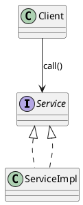
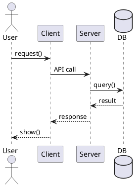

## 1 软件体系结构概论
### 1.1 软件重用
**1.定义**:在开发新的软件系统时 **重复使用已有的软件资产**
**2.软件重用的层次**:
- 按照从小到大分层:
	1. **代码级重用**
	2. **模块/组件级重用**
	3. **子系统/服务级重用**
	4. **体系结构级重用**
	5. **领域/产品线级重用（最高层）**

### 1.2 软件危机
**1.定义**: 随着软件规模和复杂度上升 开发无法有效控制 导致项目出现**进度失控 成本超支 质量低下 维护困难等问题**
**2.解决方法**: 
1. **采用软件工程**
2. **使用结构化/面向对象方法**
3. **规范化开发过程与管理**
4. **提高质量保证与测试**
5. **开发工具与平台支持**
## 2 软件体系结构建模

### 2.1 软件体系结构建模
#### 2.1.1 建模目标
- **定义**: 描述系统的**构件、连接件、配置**以及与质量属性相关的关键决策
- **作用/意义**: 
	1. **便于沟通与理解**
	2. **支持分析与评估**
	3. **降低复杂度**
	4. **指导设计与实现**
	5. **促进复用与演化**
	6. **风险控制**

#### 2.1.2 4+1 视图
- **逻辑视图**：功能抽象 描述模块间的关系
- **开发视图**：系统详细设计和构造抽象 描述模块分组
- **进程视图**：描述系统非功能属性和运行时特性
- **物理视图**：描述物理部署环境和映射关系
- **场景视图**：描述系统典型场景和功能

#### 2.1.3 架构描述三要素
- **组件**：模块、服务、子系统、数据库等
- **连接件**：调用、消息队列、事件总线、共享数据、RPC/REST
- **约束**：依赖规则、接口契约、性能/安全要求

---

## 3 软件体系结构风格

### 3.1 软件体系结构风格

#### 3.1.1 分层
- **定义**：将系统按职责划分为若干**层**，每层只完成本层功能，并通过明确接口与相邻层交互；通常限制依赖方向为**上层依赖下层**（或只允许相邻层调用），以实现职责分离与可替换。

#### 3.1.2 管道-过滤器
- **定义**：将处理过程拆分为一系列**过滤器**，过滤器之间通过**管道**传递数据流；每个过滤器对输入数据进行变换/处理并输出结果，多个过滤器按顺序组合形成整体流水线。

#### 3.1.3 客户端-服务器（C/S）
- **定义**：系统分为**客户端**与**服务器**两类角色：客户端发起请求（常包含界面/部分逻辑），服务器集中提供服务（业务处理、数据管理等）并响应请求；两者通过网络协议进行“请求-响应”式通信与协作。

#### 3.1.4 MVC
- **定义**：将交互式应用按职责分为三部分：
  - **Model**：数据与业务规则（状态、业务逻辑）
  - **View**：界面展示（呈现 Model）
  - **Controller**：输入控制与协调（接收操作→调用 Model 更新→驱动 View 刷新）
  通过分离关注点降低耦合，便于维护与扩展界面。

#### 3.1.5 事件驱动 / 发布订阅
- **定义**：以**事件**为触发中心：发布者将事件发布到事件通道/总线/消息代理（broker），订阅者订阅感兴趣的事件并在事件发生时接收通知或拉取处理；发布者与订阅者通常**不直接依赖**，实现时间与空间上的解耦。

#### 3.1.6 仓库 / 共享数据
- **定义**：以一个中心**数据仓库**作为共享数据源，各组件通过读取/写入仓库进行协作；组件之间一般不直接传数据，而通过仓库实现数据共享与一致性管理（仓库通常包含统一数据模型与访问机制）。

#### 3.1.7 微内核
- **定义**：系统由一个最小**核心**提供稳定基础能力（如插件管理、通信机制、最基本服务），其余功能以**插件/扩展**形式挂载；通过“核心稳定 + 插件可插拔”实现按需扩展与裁剪。

---

## 4 统一建模语言 UML

### 4.1 UML 建模
#### 4.1.1 必会图与用途
- **用例图**：需求范围、参与者、用例关系（include/extend）
- **类图**：结构设计（继承/实现/关联/聚合/组合/依赖）
- **序列图**：对象交互顺序（同步/异步/返回/激活条）
- **活动图**：流程（分支、并行、泳道）
- **状态图**：对象状态变化（事件触发）
- **组件图/部署图**：架构模块与部署节点映射

#### 4.1.2 类图关系速记（常考）
- **继承/实现**：is-a
- **关联**：has-a（一般关系）
- **聚合**：弱拥有（整体-部分，但生命周期不绑定）
- **组合**：强拥有（生命周期绑定）
- **依赖**：临时使用（参数/局部变量/调用）

#### 4.1.3 PlantUML 常用模板
**类图：**

**序列图：**

---

## 6 设计模式

### 6.1 设计模式六大原则
- **开闭原则(总原则)**: 对扩展开放 对修改关闭
- **单一职责**: 一个类只负责一类事情
- **里氏替换**: 子类可替换父类且不破坏正确性
- **依赖倒置**: 依赖抽象，不依赖具体实现
- **接口隔离**: 接口小而专
- **最少知道原则**: 一个类对自己依赖的类知道的越少越好

### 6.2 设计模式的分类:
- **创建型模式**:
	- 工厂方法模式
	- 抽象工厂模式
	- 单例模式
	- 建造者模式
- **结构型模式**:
	- 适配器模式
	- 装饰器模式
	- 代理模式
- **行为型模式**:
	- 观察者模式

---

### 6.3 创建型模式

#### 6.3.1 简单工厂模式

- 普通简单工厂  
  - 定义：由一个工厂根据传入的类型参数创建不同的产品对象并返回统一的产品接口  
  - 实现步骤  
    - 定义产品接口
    - 定义多个具体产品类 分别实现产品接口  
    - 定义工厂类 提供创建方法 接收类型参数并返回对应具体产品  
    - 客户端传入类型到工厂 获取产品对象  
    - 客户端通过产品接口使用对象  

- 多方法简单工厂  
  - 定义：工厂提供多个创建方法 每个方法专门创建一种产品对象  
  - 实现步骤  
    - 定义产品接口  
    - 定义多个具体产品类  
    - 工厂类提供多个创建方法 每个方法返回一种具体产品  
    - 客户端调用对应创建方法获取产品  
    - 客户端通过产品接口使用对象  

- 静态简单工厂  
  - 定义：把创建方法做成静态 工厂构造方法私有化 客户端无需实例化工厂即可创建产品  
  - 实现步骤  
    - 定义产品接口  
    - 定义多个具体产品类  
    - 工厂类构造方法私有化  
    - 工厂类提供静态创建方法 返回具体产品对象  
    - 客户端直接调用静态创建方法 获取产品并使用  

#### 6.3.2 工厂方法模式

- 定义：定义工厂接口规定创建方法 由不同的具体工厂负责创建不同的具体产品  
- 实现步骤  
  - 定义产品接口  
  - 定义具体产品类 实现产品接口  
  - 定义工厂接口 规定创建方法  
  - 定义多个具体工厂类 每个具体工厂创建一种具体产品  
  - 客户端选择或注入具体工厂 调用创建方法得到产品  
  - 客户端面向产品接口使用对象  

#### 6.3.3 抽象工厂模式

- 定义：定义一个工厂接口 用来创建一族相关产品 通过同一个具体工厂保证同族产品一致性  
- 实现步骤  
  - 定义多种抽象产品接口 例如一种产品族里的多种产品类别  
  - 定义抽象工厂接口 包含创建每一种抽象产品的方法  
  - 定义具体工厂类 每个具体工厂代表一个产品族 并实现全部创建方法  
  - 定义具体产品类 每个产品族对应一组具体产品 分别实现各自抽象产品接口  
  - 客户端选择具体工厂  
  - 客户端通过该工厂创建一整套产品并使用  
- 扩展要点  
  - 扩展产品族：新增一个具体工厂 并新增该族的一组具体产品  
  - 扩展产品种类：需要改抽象工厂接口 并同步修改所有具体工厂  

#### 6.3.4 单例模式

- 定义：保证一个类在系统中只有一个实例 并提供统一访问方式  
- 实现步骤  
  - 构造方法私有化 禁止外部直接创建  
  - 类内部保存唯一实例引用  
  - 提供获取实例的方法 返回唯一实例  
#### 6.3.5 建造者模式

- 定义：把复杂对象的构建拆成多个步骤 由建造者逐步完成 最终组装得到产品  
- 实现步骤  
  - 定义产品类 包含多个部件  
  - 定义建造者接口 规定构建各部件的方法
  - 定义具体建造者类 实现各部件构建
  - 定义指挥者类 负责按顺序调用建造者步骤完成构建  
  - 客户端选择具体建造者 交给指挥者执行构建流程  
  - 客户端获取最终产品并使用  
- 对比提示  
  - 工厂更关注创建哪一种对象  
  - 建造者更关注对象的构建步骤与过程  

### 6.4 结构型模式

#### 6.4.1 适配器模式

- 目的：把已有类的接口转换为上层期望的目标接口 解决接口不兼容问题  
- 类别  
  - 类适配器  
    - 实现关系：适配器继承已有类 并实现目标接口  
    - 实现步骤  
      - 定义目标接口 上层只依赖目标接口  
      - 保留已有类 不修改其代码  
      - 定义适配器类 继承已有类 实现目标接口  
      - 在目标接口方法中转调已有类方法 并完成必要的参数转换  
      - 客户端面向目标接口使用适配器  
  - 对象适配器  
    - 实现关系：适配器持有已有类实例 并实现目标接口  
    - 实现步骤  
      - 定义目标接口  
      - 定义已有类  
      - 定义适配器类 实现目标接口 并在内部保存已有类对象  
      - 在目标接口方法中调用已有类对象的方法 并完成必要的参数转换  
      - 客户端面向目标接口使用适配器  
  - 接口适配器  
    - 实现关系：抽象适配器为多方法接口提供默认实现 子类按需重写  
    - 实现步骤  
      - 定义多方法接口  
      - 定义适配器类 实现该接口 并为所有方法提供默认实现  
      - 定义具体子类 继承适配器类 只重写需要的方法  
      - 客户端使用具体子类对象  

#### 6.4.2 装饰器模式

- 定义：在不修改原类的前提下 通过包装在运行时为对象动态叠加功能  
- 要求  
  - 装饰者与被装饰对象实现同一抽象  
  - 装饰者内部持有被装饰对象实例  
- 实现步骤  
  - 定义抽象组件 规定核心功能方法  
  - 定义具体组件 实现核心功能  
  - 定义抽象装饰类 实现抽象组件 并持有一个抽象组件对象  
  - 定义具体装饰类 继承抽象装饰类 在调用前后添加增强逻辑  
  - 客户端先创建具体组件 再按需要使用多个装饰类逐层包装  
  - 客户端面向抽象组件调用 实际执行时功能被叠加  
- 区分提示  
  - 适配器解决接口不兼容  
  - 装饰器在接口不变的前提下增强功能  

### 6.5 **行为型模式**
#### 6.5.1 观察者模式
- 定义: 当一个对象变化时 其他依赖该对象的对象都会收到通知 并随之变化 对象间是一对多的关系
- 步骤: 
	- 被观察者维护一个观察者队列
	- 观察对象分别向队列进行注册订阅
	- 被观察者遍历列表 调用每个观察者的更新事件
	- 观察对象收到通知执行自己的相应 调用对应的方法
