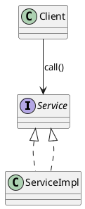
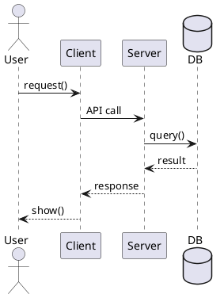

## 1 软件体系结构概论
### 1.1 软件重用
**1.定义**:在开发新的软件系统时 **重复使用已有的软件资产**
**2.软件重用的层次**:
- 按照从小到大分层:
	1. **代码级重用**
	2. **模块/组件级重用**
	3. **子系统/服务级重用**
	4. **体系结构级重用**
	5. **领域/产品线级重用（最高层）**

### 1.2 软件危机
**1.定义**: 随着软件规模和复杂度上升 开发无法有效控制 导致项目出现**进度失控 成本超支 质量低下 维护困难等问题**
**2.解决方法**: 
1. **采用软件工程**
2. **使用结构化/面向对象方法**
3. **规范化开发过程与管理**
4. **提高质量保证与测试**
5. **开发工具与平台支持**
## 2 软件体系结构建模

### 2.1 软件体系结构建模
#### 2.1.1 建模目标
- **定义**: 描述系统的**构件、**连接件**、**配置**以及与质量属性相关的关键决策
- **作用/意义**: 
	1. **便于沟通与理解**
	2. **支持分析与评估**
	3. **降低复杂度**
	4. **指导设计与实现**
	5. **促进复用与演化**
	6. **风险控制**

#### 2.1.2 4+1 视图
- **逻辑视图**：功能抽象 描述模块间的关系
- **开发视图**：系统详细设计和构造抽象 描述模块分组
- **进程视图**：描述系统非功能属性和运行时特性
- **物理视图**：描述物理部署环境和映射关系
- **场景视图**：描述系统典型场景和功能

#### 2.1.3 架构描述三要素
- **组件**：模块、服务、子系统、数据库等
- **连接件**：调用、消息队列、事件总线、共享数据、RPC/REST
- **约束**：依赖规则、接口契约、性能/安全要求

---

## 3 软件体系结构风格

### 3.1 软件体系结构风格

#### 3.1.1 分层
- **定义**：将系统按职责划分为若干**层**，每层只完成本层功能，并通过明确接口与相邻层交互；通常限制依赖方向为**上层依赖下层**（或只允许相邻层调用），以实现职责分离与可替换。
- **优点**：职责清晰、可维护、易替换
- **缺点**：跨层需求麻烦、性能可能下降
- **场景**：企业应用、传统 Web 三层

#### 3.1.2 管道-过滤器
- **定义**：将处理过程拆分为一系列**过滤器**，过滤器之间通过**管道**传递数据流；每个过滤器对输入数据进行变换/处理并输出结果，多个过滤器按顺序组合形成整体流水线。
- **优点**：易复用、易并行
- **缺点**：不适合强交互、状态共享困难
- **场景**：编译器、数据/日志流水线

#### 3.1.3 客户端-服务器（C/S）/ 三层
- **定义**：系统分为**客户端**与**服务器**两类角色：客户端发起请求（常包含界面/部分逻辑），服务器集中提供服务（业务处理、数据管理等）并响应请求；两者通过网络协议进行“请求-响应”式通信与协作。
- **优点**：集中管理、可控
- **缺点**：服务器压力大、网络依赖强
- **场景**：Web/APP 后端

#### 3.1.4 MVC
- **定义**：将交互式应用按职责分为三部分：
  - **Model**：数据与业务规则（状态、业务逻辑）
  - **View**：界面展示（呈现 Model）
  - **Controller**：输入控制与协调（接收操作→调用 Model 更新→驱动 View 刷新）
  通过分离关注点降低耦合，便于维护与扩展界面。
- **优点**：关注点分离、便于维护
- **缺点**：结构复杂度提高
- **场景**：GUI、Web 前端/后端框架

#### 3.1.5 事件驱动 / 发布订阅
- **定义**：以**事件**为触发中心：发布者将事件发布到事件通道/总线/消息代理（broker），订阅者订阅感兴趣的事件并在事件发生时接收通知或拉取处理；发布者与订阅者通常**不直接依赖**，实现时间与空间上的解耦。
- **优点**：强解耦、扩展性好
- **缺点**：调试困难、时序难控
- **场景**：消息系统、异步业务、微服务集成

#### 3.1.6 仓库 / 共享数据
- **定义**：以一个中心**数据仓库**作为共享数据源，各组件通过读取/写入仓库进行协作；组件之间一般不直接传数据，而通过仓库实现数据共享与一致性管理（仓库通常包含统一数据模型与访问机制）。
- **优点**：数据一致、集中管理
- **缺点**：单点风险、数据模型耦合强
- **场景**：数据平台、共享数据库系统

#### 3.1.7 微内核
- **定义**：系统由一个最小**核心**提供稳定基础能力（如插件管理、通信机制、最基本服务），其余功能以**插件/扩展**形式挂载；通过“核心稳定 + 插件可插拔”实现按需扩展与裁剪。
- **优点**：可插拔、可扩展
- **缺点**：设计门槛高、抽象复杂
- **场景**：插件式平台、IDE

---

## 4 统一建模语言 UML

### 4.1 UML 建模
#### 4.1.1 必会图与用途
- **用例图**：需求范围、参与者、用例关系（include/extend）
- **类图**：结构设计（继承/实现/关联/聚合/组合/依赖）
- **序列图**：对象交互顺序（同步/异步/返回/激活条）
- **活动图**：流程（分支、并行、泳道）
- **状态图**：对象状态变化（事件触发）
- **组件图/部署图**：架构模块与部署节点映射

#### 4.1.2 类图关系速记（常考）
- **继承/实现**：is-a
- **关联**：has-a（一般关系）
- **聚合**：弱拥有（整体-部分，但生命周期不绑定）
- **组合**：强拥有（生命周期绑定）
- **依赖**：临时使用（参数/局部变量/调用）

#### 4.1.3 PlantUML 常用模板
**类图：**

**序列图：**

### 4.2 UML 视频（复习抓重点）
- 类关系符号、序列图消息类型、部署图节点/组件映射（最常考细节）

---

## 5 基于服务的软件体系结构

### 5.1 基于服务的体系结构（SOA）
#### 5.1.1 核心思想
- 将系统能力封装为**服务**，通过标准接口/协议调用，强调复用与集成。
- 关注：服务边界、契约（接口）、治理（版本/权限/监控/审计）。

---

## 6 设计模式

### 6.1 设计模式六大原则
- **开闭原则(总原则)**: 对扩展开放 对修改关闭
- **单一职责**: 一个类只负责一类事情
- **里氏替换**: 子类可替换父类且不破坏正确性
- **依赖倒置**: 依赖抽象，不依赖具体实现
- **接口隔离**: 接口小而专
- **最少知道原则**: 一个类对自己依赖的类知道的越少越好

### 6.2 设计模式的分类:
- **创建型模式**:
	- 工厂方法模式
	- 抽象工厂模式
	- 单例模式
	- 建造者模式
- **结构型模式**:
	- 适配器模式
	- 装饰器模式
	- 代理模式
	- 桥接模式
- **行为型模式**:
	- 策略模式
	- 模板方法模式

---

### 6.3 创建型模式
#### 6.3.1 简单工厂模式
- **普通简单工厂**
	- 实现: 通过else-if判断类 通过传入的类型创建对象
	- 优点:简单
	- 缺点:违背开闭原则
- **多方法简单工厂**
	- 实现: 将if-else替换为方法
- **静态简单工厂**
	- 实现: 在多方法上静态+私有(不需要实例化工厂类)
-  **适用场景**: 大量产品需要创建 且具有共同接口
#### 6.3.1 工厂方法模式
- 实现: 每种对象添加一个工厂子类
- 优点: 符合开闭原则
- 缺点: 类数量多
- **适用场景**: 大量产品需要创建 且具有共同接口
#### 6.3.2 抽象工厂模式
- 实现: 抽象工厂类 添加新产品就添加新工厂类
#### 6.3.3 单例模式

#### 6.3.4 建造者模式
- 实现: 实现生产+创建多个对象 多个复杂部件集成到一个对象里面
- **工厂关注创建的对象 建造者关注创建的过程**
- **多产品选工厂 多功能选建造者**

### 6.4 **结构型模式**
#### 6.4.1 适配器模式
目的: 消除接口不匹配导致的类兼容性问题
类别: 
- 类适配器
	- 实现: **下层已有类<--继承--适配器--实现-->上层目标接口**
- 对象适配器
	- 实现: **下层已有类<--持有实例--适配器--实现-->上层目标接口**
- 接口适配器
	- 实现: **重写一个类 继承抽象类 并只需要重写使用的方法**
#### 6.4.2 装饰器模式

#### 6.4.3 代理模式

### 6.5 **行为型模式**

#### 6.5.1 策略模式

#### 6.5.2 模板方法模式

### 6.4 适配器模式（Adapter）
- 解决：接口不兼容但要复用旧类
- 类型：类适配器（继承）/ 对象适配器（组合，更常用）

### 6.5 装饰模式（Decorator）
- 解决：不改原类前提下**动态叠加功能**
- 要点：装饰者与被装饰者实现同一接口

### 6.6 代理模式（Proxy）
- 解决：控制访问/增强（远程代理、虚拟代理、保护代理、缓存代理）
- 区分：装饰强调“加功能”，代理强调“控制访问/间接访问”

### 6.7 观察者模式（Observer）
- 一对多依赖：主题状态变化自动通知观察者
- 注意：通知风暴、循环依赖、异步一致性

### 6.8 桥接模式（Bridge）
- 抽象与实现分离，两维变化独立扩展
- 典型：形状（圆/方）× 颜色（红/蓝）避免类爆炸

---

## 期末快速自测（背答案框架）
1. 软件体系结构定义是什么？包含哪三类元素？
2. 4+1 视图分别解决什么问题？
3. 分层风格的优缺点各写两条，并举例。
4. 事件驱动为什么解耦？带来什么代价？
5. CORBA 为什么能跨语言？IDL/ORB/Stub/Skeleton 分别是什么？
6. UML 中聚合与组合区别？
7. 简单工厂/工厂方法/抽象工厂适用场景分别是什么？
8. 装饰 vs 代理怎么区分？各举例。
9. Builder vs Factory 区别是什么？
10. Bridge vs Adapter 区别是什么？
