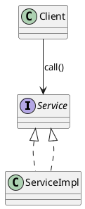
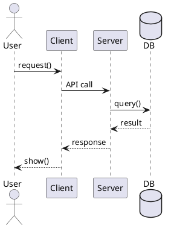

# 软件体系结构复习笔记（按课程目录）

## 1 软件体系结构概论

### 1.1 软件体系结构概论
#### 1.1.1 核心定义（常考简答）
- **软件体系结构**：描述系统的**构件（Components）**、**连接件（Connectors）**、**配置（Configuration）**以及指导系统设计与演化的关键决策与约束。
- 架构关注：**系统级结构**与**质量属性权衡**（trade-off），不仅是功能实现。

#### 1.1.2 架构 vs 设计 vs 实现（会考区分）
- **架构**：宏观结构与关键决策（分层/通信/部署/选型/约束/质量属性取舍）
- **设计**：模块、类、接口层面的方案
- **实现**：代码细节与具体算法

#### 1.1.3 质量属性（必背）
- 性能、可靠性、可用性、安全性、可维护性（可修改性）、可测试性、可扩展性、可移植性、易用性  
- 要点：架构设计的核心是对这些指标的**权衡**。

---

## 2 软件体系结构建模

### 2.1 软件体系结构建模
#### 2.1.1 建模目标
- 说明系统：**有哪些主要构件、如何交互、如何部署、如何演进**
- 建模价值：沟通、分析、验证、复用、文档化

#### 2.1.2 4+1 视图（高频）
- **逻辑视图**：类/对象结构，功能分解
- **开发视图**：模块/包/组件组织，代码结构
- **过程视图**：进程/线程/并发/通信
- **物理视图**：部署节点、网络拓扑、映射关系
- **场景（+1）**：用例/序列图贯穿，验证设计是否满足需求

#### 2.1.3 架构描述三要素
- **组件**：模块、服务、子系统、数据库等
- **连接件**：调用、消息队列、事件总线、共享数据、RPC/REST
- **约束**：依赖规则、接口契约、性能/安全要求

---

## 3 软件体系结构风格

### 3.1 软件体系结构风格（背：定义 + 适用场景 + 优缺点）

#### 3.1.1 分层（Layered）
- **优点**：职责清晰、可维护、易替换
- **缺点**：跨层需求麻烦、性能可能下降
- **场景**：企业应用、传统 Web 三层

#### 3.1.2 管道-过滤器（Pipe & Filter）
- **优点**：易复用、易并行
- **缺点**：不适合强交互、状态共享困难
- **场景**：编译器、数据/日志流水线

#### 3.1.3 客户端-服务器（C/S）/ 三层
- **优点**：集中管理、可控
- **缺点**：服务器压力大、网络依赖强
- **场景**：Web/APP 后端

#### 3.1.4 MVC
- **优点**：关注点分离、便于维护
- **缺点**：结构复杂度提高
- **场景**：GUI、Web 前端/后端框架

#### 3.1.5 事件驱动 / 发布订阅（Event-based / Pub-Sub）
- **优点**：强解耦、扩展性好
- **缺点**：调试困难、时序难控
- **场景**：消息系统、异步业务、微服务集成

#### 3.1.6 仓库 / 共享数据（Repository）
- **优点**：数据一致、集中管理
- **缺点**：单点风险、数据模型耦合强
- **场景**：数据平台、共享数据库系统

#### 3.1.7 微内核（Microkernel）
- **优点**：可插拔、可扩展
- **缺点**：设计门槛高、抽象复杂
- **场景**：插件式平台、IDE

> 常考答题套路：把“风格”与“质量属性”绑定（可修改性/性能/可扩展性/可维护性）。

### 3.2 软件体系结构风格2（常见对比）
- **SOA vs 微服务**：都服务化，但 SOA 更偏企业集成/治理，微服务更偏小而自治/独立部署/DevOps
- **单体 vs 分布式**：分布式故障隔离与扩展更强，但运维与通信复杂度更高

### 3.3 基于 CORBA 实现 JAVA 和 C++ 混合编程（流程题高频）
#### 3.3.1 核心概念
- **IDL**：接口描述语言（语言无关）
- **ORB**：对象请求代理（定位对象、封装/解封、网络通信）
- **Stub/Skeleton**：客户端代理 / 服务端骨架
- **IIOP**：常见互联互通传输协议

#### 3.3.2 基本步骤（背这个）
1. 编写 **IDL** 定义接口
2. 用 IDL 编译器生成 Java/C++ 的 **Stub/Skeleton**
3. 服务端实现接口并发布对象引用
4. 客户端通过 ORB 获取对象引用，像本地对象一样调用（实际远程）

#### 3.3.3 常见考点
- 为什么跨语言：双方遵循 IDL 规范与语言映射 + ORB 负责通信
- 缺点：复杂、重量级、部署配置麻烦（现代常用 REST/gRPC）

---

## 4 统一建模语言 UML

### 4.1 UML 建模
#### 4.1.1 必会图与用途
- **用例图**：需求范围、参与者、用例关系（include/extend）
- **类图**：结构设计（继承/实现/关联/聚合/组合/依赖）
- **序列图**：对象交互顺序（同步/异步/返回/激活条）
- **活动图**：流程（分支、并行、泳道）
- **状态图**：对象状态变化（事件触发）
- **组件图/部署图**：架构模块与部署节点映射

#### 4.1.2 类图关系速记（常考）
- **继承/实现**：is-a
- **关联**：has-a（一般关系）
- **聚合**：弱拥有（整体-部分，但生命周期不绑定）
- **组合**：强拥有（生命周期绑定）
- **依赖**：临时使用（参数/局部变量/调用）

#### 4.1.3 PlantUML 常用模板
**类图：**

**序列图：**

### 4.2 UML 视频（复习抓重点）
- 类关系符号、序列图消息类型、部署图节点/组件映射（最常考细节）

---

## 5 基于服务的软件体系结构

### 5.1 基于服务的体系结构（SOA）
#### 5.1.1 核心思想
- 将系统能力封装为**服务**，通过标准接口/协议调用，强调复用与集成。
- 关注：服务边界、契约（接口）、治理（版本/权限/监控/审计）。

#### 5.1.2 SOA vs 微服务（对比题）
- **SOA**：企业级集成，粒度可能更大，治理/ESB 思想更强
- **微服务**：更小更自治，独立部署，DevOps/容器化常见
- **共同点**：服务化、接口契约、分布式通信

---

## 6 设计模式

### 6.1 面向对象设计原则（SOLID 必背）
- **S** 单一职责：一个类只负责一类变化
- **O** 开闭原则：对扩展开放、对修改关闭
- **L** 里氏替换：子类可替换父类且不破坏正确性
- **I** 接口隔离：接口小而专
- **D** 依赖倒置：依赖抽象，不依赖具体实现

---

### 6.2 工厂设计模式（区分题高频）

#### 6.2.1 简单工厂
- 一个工厂方法用 if/switch 创建不同产品
- **优点**：调用简单
- **缺点**：新增产品要改工厂（违背开闭）

#### 6.2.2 工厂方法
- 每种产品对应一个工厂子类
- **优点**：新增产品不改旧代码
- **缺点**：类数量增多

#### 6.2.3 抽象工厂
- 生产“产品族”（一整套相关产品）
- **优点**：保证产品族一致性
- **缺点**：扩展新“产品种类”麻烦

---

### 6.3 建造者模式（Builder）
- 解决：复杂对象**分步骤构建**
- 结构：Director（可选） + Builder + ConcreteBuilder + Product
- 典型：套餐/复杂配置对象构建

### 6.4 原型模式（Prototype）
- 解决：创建成本高，用 **clone** 快速复制
- 常考：浅拷贝 vs 深拷贝区别与风险

### 6.5 适配器模式（Adapter）
- 解决：接口不兼容但要复用旧类
- 类型：类适配器（继承）/ 对象适配器（组合，更常用）

### 6.6 装饰模式（Decorator）
- 解决：不改原类前提下**动态叠加功能**
- 要点：装饰者与被装饰者实现同一接口

### 6.7 代理模式（Proxy）
- 解决：控制访问/增强（远程代理、虚拟代理、保护代理、缓存代理）
- 区分：装饰强调“加功能”，代理强调“控制访问/间接访问”

### 6.8 观察者模式（Observer）
- 一对多依赖：主题状态变化自动通知观察者
- 注意：通知风暴、循环依赖、异步一致性

### 6.9 组合模式（Composite）
- 树形结构统一对待“整体/部分”
- 典型：文件/文件夹

### 6.10 桥接模式（Bridge）
- 抽象与实现分离，两维变化独立扩展
- 典型：形状（圆/方）× 颜色（红/蓝）避免类爆炸

---

## 期末快速自测（背答案框架）
1. 软件体系结构定义是什么？包含哪三类元素？
2. 4+1 视图分别解决什么问题？
3. 分层风格的优缺点各写两条，并举例。
4. 事件驱动为什么解耦？带来什么代价？
5. CORBA 为什么能跨语言？IDL/ORB/Stub/Skeleton 分别是什么？
6. UML 中聚合与组合区别？
7. 简单工厂/工厂方法/抽象工厂适用场景分别是什么？
8. 装饰 vs 代理怎么区分？各举例。
9. Builder vs Factory 区别是什么？
10. Bridge vs Adapter 区别是什么？
